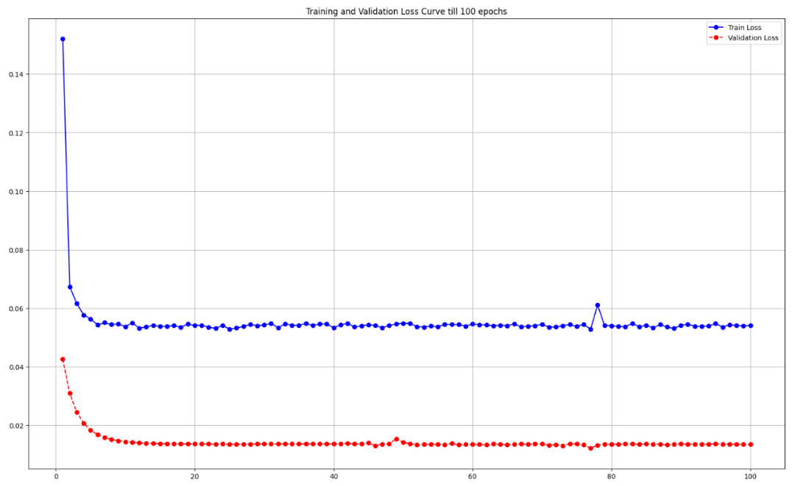
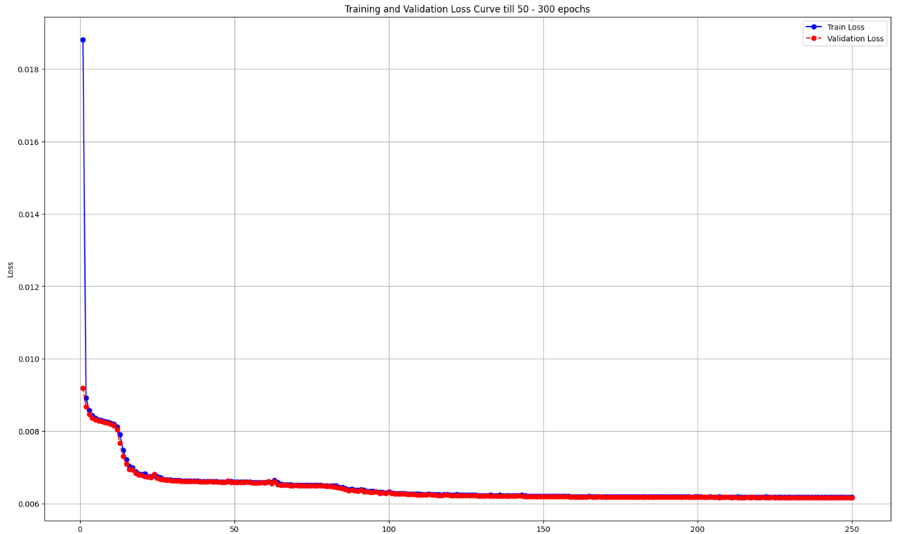
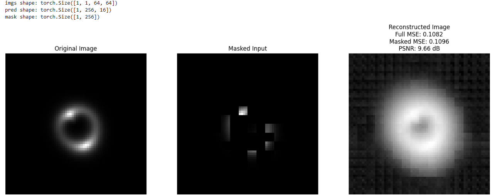
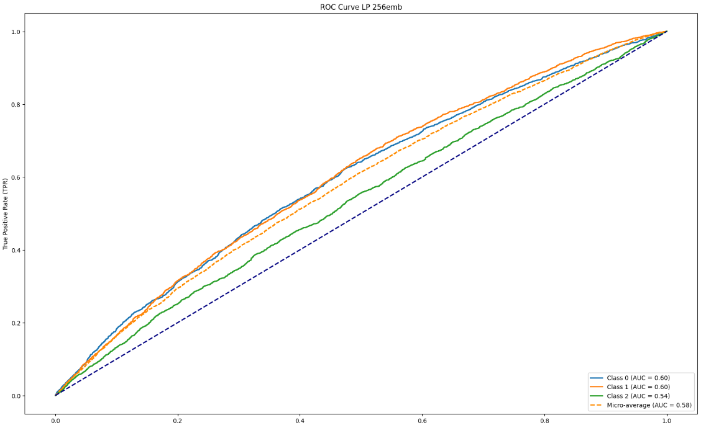
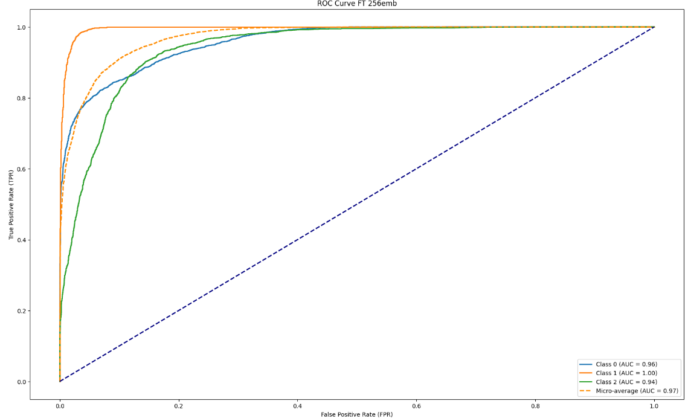

# Fine-tuning a Pretrained Masked Autoencoder (MAE) for Classification

## Introduction
This project utilizes a pretrained **Masked Autoencoder (MAE)** for image classification on a given dataset. The approach consists of two stages:
1. **Linear Probing:** Training a classification head while keeping the pretrained MAE frozen.
2. **Full Fine-tuning:** Unfreezing the MAE and optimizing all model parameters for better performance.

## Pretraining Details

The MAE model was pretrained using a self-supervised learning approach by reconstructing masked image patches. The pretraining was conducted in two phases:  

1. **Without Augmentations** (100 epochs)  
2. **With Augmentations** (250 epochs)  

During pretraining with augmentations, validation loss (BCEWithLogitsLoss) quickly stabilized around **0.02** at approximately **20 epochs**, suggesting that augmentations primarily contributed to initial rapid learning but had limited long-term benefits. Consequently, epochs between **20 and 100** appeared ineffective.  

In total, **350 epochs** were run (**100 epochs without augmentations + 250 epochs with augmentations**).
Below are the loss curve and sample reconstructed images from pretraining:

### Pretraining Loss Curve with augmentation ( 1 - 100 epochs)

### Pretraining Loss Curve without augmentation ( 101 - 350 epochs)

### Pretraining Output Samples

## Fine-tuning Approach
### 1. Linear Probing
- The pretrained MAE encoder is **frozen**, and only a newly added classification MLP is trained.
- This step evaluates how well the MAE encoder captures meaningful features.

### 2. Full Fine-tuning
- The entire model, including the MAE encoder, is **unfrozen** and fine-tuned end-to-end.
- This allows the encoder to adapt to the classification task.

### ROC-AUC Curves
#### Linear Probing ROC-AUC

#### Full Fine-tuning ROC-AUC

## Hyperparameters & Training Details
| Phase              | Optimizer  | Learning Rate | Scheduler  | # Parameters |
|-------------------|------------|--------------|------------|-------------|
| Linear Probing    | LARS      | 1e-3 (SGD Base)         | Cosine Annealing | ~200K  |
| Full Fine-tuning  | AdamW      | 9.5e-5 for encoder, 8e-4 for others         | Cosine Annealing | ~6.6M  |

