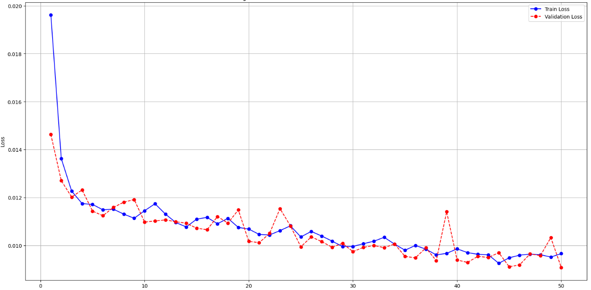

# Super-Resolution Model

## Overview
This project implements a Super-Resolution model that enhances the resolution of low-quality images using a pretrained MAE. The model is built on a base architecture and can be fine-tuned to improve performance. I have reorganised the provided dataset into Train and Val subsets. My split dataset is availiable on Kaggle so that the results can be reproduced. (Notebook mentions the function used to reorganise)

## Base Model
The base model used in this project is Masked AutoEncoder trained from scratch on given dataset. It has been pre-trained and further fine-tuned for improved results. The MAE is adapted for super resolution using convolution and deconvolution operations. 

## Performance Metrics
The table below summarizes the model's performance across different configurations:
| Mode             | MSE ↓  | PSNR ↑ | SSIM ↑ | # Finetune Params | # Epochs | Comment                          |
|-----------------|--------|--------|--------|-------------------|----------|----------------------------------|
| Freezed MAE     | 0.000921 | 30.3562 | 0.9524 | 167.7K            | 150      |     Only convolution layers trained                             |
| Freezed Encoder | 0.000921 | 30.3562 | 0.9524 | 996K           | 150      |      None                            |
| Full Finetune   | **0.000427** | **33.6931** | **0.9681** | **7.38M**          | 50       | Initialized from freezed enc ckpt |

- **MSE (Mean Squared Error)**: Lower is better.
- **PSNR (Peak Signal-to-Noise Ratio)**: Higher is better.
- **SSIM (Structural Similarity Index Measure)**: Higher is better.

## Model Architecture

## Training / Val Loss Curves
- **Freezed Encoder Finetuning**  
  

- **Full Finetuning**  
  

## Sample Outputs
  
## Training & Fine-Tuning
- Dataset: Provided dataset was organised into 90:10 Train:Val split. [mae-sr-dataset-split](https://www.kaggle.com/datasets/mldtype/mae-sr-dataset-split) 
- Optimiser: AdamW with weight_decay = 1e-4

| Layer         | Learning Rate |
|-----------------|----------------|
| Encoder         | 8e-5      |
| Others         | 5e-4      |

- Scheduler: CosineAnnealingWarmRestarts with T_0=10, T_mult=1, eta_min = 8e-5
- Loss function: **L1 Loss**.
- Data augmentation techniques: None. Images were already normalised.

## Future Improvements
- Implement attention mechanisms for better feature extraction.
- Train on a larger dataset for improved generalization.
- Experiment with GAN-based super-resolution methods.
