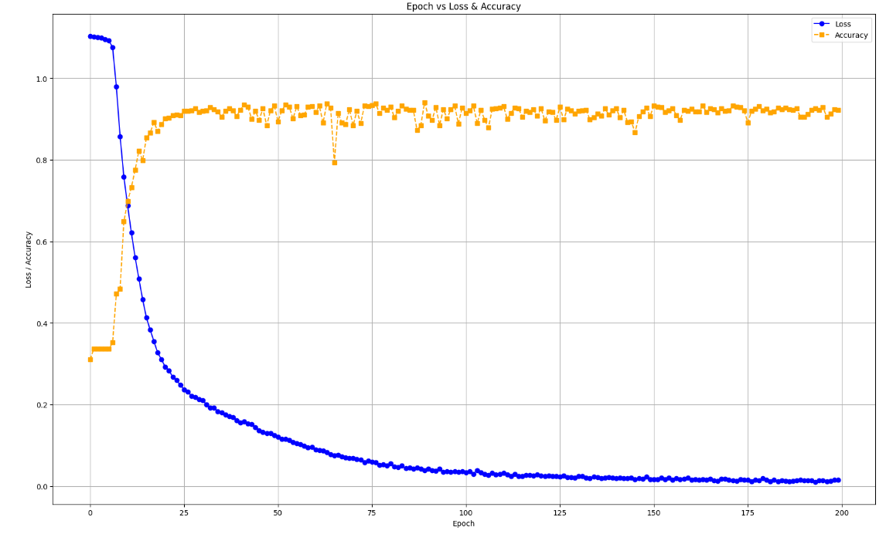
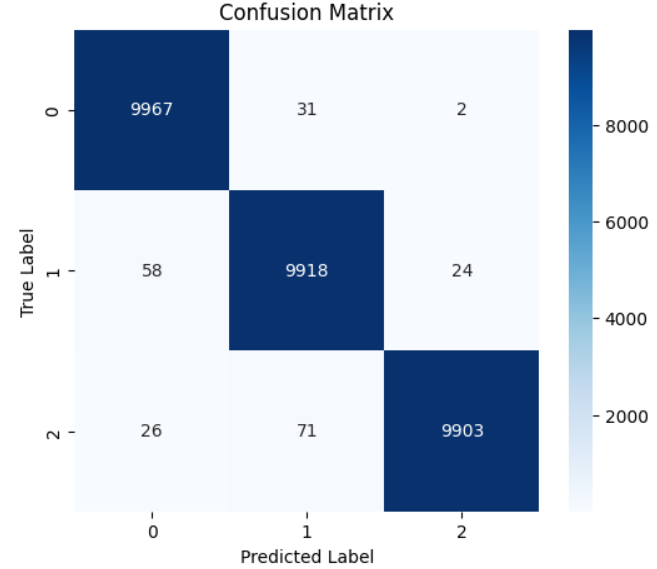
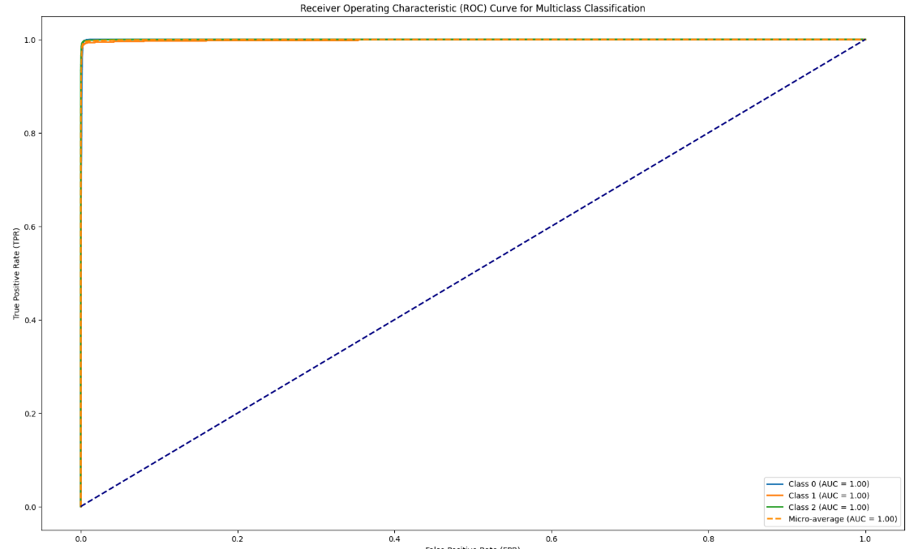

# Multiclass Classification of Gravitational Lensing Images

## Overview
This repository contains the implementation of a CNN model for classifying gravitational lensing images into three distinct classes.
## Model Architecture
- Base model: ResNet-18
- Enhancements: Addition of 2 SqueezeExcite blocks
- Classification: Multiclass (3 classes)

## Results
### Performance Metrics
|Class Name| Class Label | AUC Score |
|------------|------------|-----------|
|no| Class 0   | 1      |
|sphere| Class 1    |1     |
|vort| Class 2    | 1     |

### Training Parameters
| Parameter    | Value         |
|-------------|--------------|
| # Epochs    | 200           |
| Optimizer   | Adam         |
| Learning Rate | 1e-4     |
| # Parameters | 13.6M         |
| Remarks     | SqueezeNet blocks improved feature extraction |

## Visualizations
### Loss Curve

### Confusion Matrix

### ROC-AUC Curve

